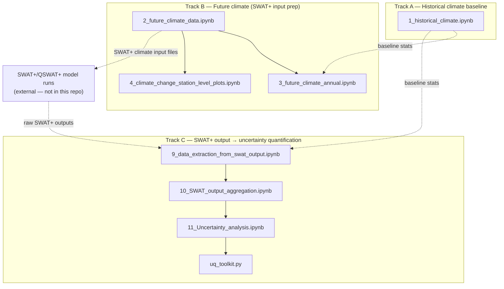

# Uncertainty Analysis of Streamflow under Climate and Land-Use Change

Research code for quantifying uncertainty in future streamflow projections for a river
basin, driven by bias-corrected GCM climate projections and SWAT+ hydrological modeling,
and decomposing that uncertainty by source (climate model, emissions scenario, land-use
change).

## Pipeline

Three largely independent tracks that meet only at the very end (SWAT+ model runs happen
outside this repo, in QSWAT+/SWAT+ itself, consuming the climate files these notebooks
prepare):



- **Track A** processes observed station data into the historical monthly/yearly
  precipitation and temperature baseline everything else compares against.
- **Track B** bias-corrects and reformats 4 selected GCMs (2 emissions scenarios each) into
  SWAT+-ready daily climate input files, plus diagnostic plots.
- **Track C** extracts SWAT+ channel-flow output across the full land-use × climate-change
  scenario matrix, aggregates it per channel, and runs the uncertainty quantification /
  source-attribution analysis (`uq_toolkit.py`) — variance decomposition, source
  attribution, flow-duration curves, probability of change, and more.

Run in numeric order: `1_` → `2_` → `3_`/`4_` → (SWAT+ model runs, external) → `9_` → `10_`
→ `11_`.

## Results

This pipeline was developed as part of a larger climate-hydrology consultancy assessment for
a monsoon-dominated rain-fed river basin. See **[results-highlights.md](results-highlights.md)**
for a summary of the main findings — climate ensemble spread, land-use change, season-dependent
uncertainty attribution, and the integrated impact results.

## Data layout

This repo is code only — the underlying climate and model data (tens of GB) isn't published
here. Every notebook expects the following **sibling** folders one level above this repo:

```
<parent folder>/
├── <this repo>/
├── All_DATA/                   observed station data + processed climate outputs
├── SWATPlus Models/             QSWAT+/SWAT+ project files and model output
└── 101_selected 4_GCMs/         bias-corrected GCM projections (4 models × 2 SSPs)
```

Recreate this structure locally with your own data before running the notebooks — they
won't run standalone from a fresh clone otherwise.

## Environment

Python 3.12. Core dependencies: `pandas`, `numpy`, `matplotlib`, `seaborn`, `openpyxl`,
`statsmodels`. (A pinned `requirements.txt` hasn't been generated yet.)

## Repo structure

- `1_`–`11_` numbered notebooks — the pipeline, in run order (see above).
- `climate_aggregation.py` — shared monthly/yearly/climatology aggregation helpers (Track A/B).
- `swat_extraction_utils.py` — shared SWAT+ output extraction helpers (Track C).
- `uq_toolkit.py` — the uncertainty quantification / source attribution engine (Track C).
